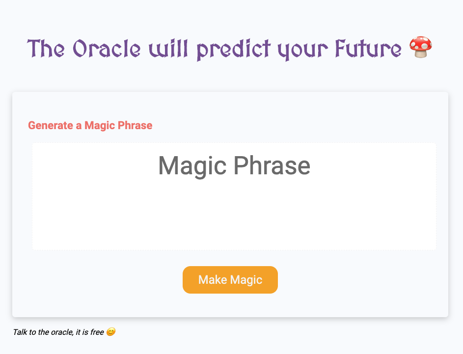
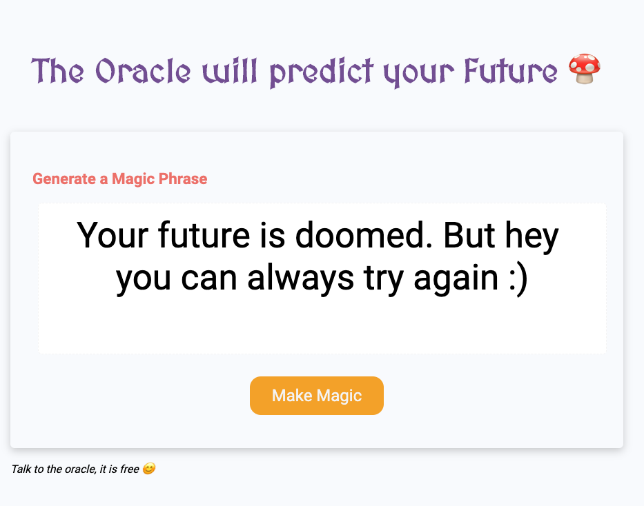

# The Oracle and the Magic Phrase

### Getting Started :rocket:

Use your recently learned skills to create a website powered by HTML, CSS and JavaScript that generates a magic phrase depending on user choices.

### Aceptance Criteria One

```
As a user I want to talk to the oracle and generate a magic phrase.
It will predict my future as a developer.
```

### Acceptance Criteria Two

```
- To generate a new phrase I need to click the button
- Then I see a series of choices (prompts) with criterias for the phrase
- Then I chose what criterias I want the phrase to fulfill
    - do I like to do sports
    - do I like to make puzzles
    - do I like pets
    - do I like pizza
    - do I like to draw or to read
    - am I a morning person or a evening one
    - ........
- After I answer all prompts, I get a magic phrase that will predict my future as a developer.
- Use your imagination to finish the game.
```

[live demo](https://js-homework-solved.netlify.app/).

## What it should look like




## Final words

Make sure you create a new repo by forking this one.

Use meaningful commit names and save your work regularly.

Deploy the app to Github pages.

---

### Made with :orange_heart: in Berlin by @CodeWithDragos

© 2019 - 2020 CodeWithDragos. All Rights Reserved.
